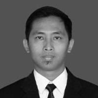

Rizki Dermawan
================

----

> **Data Engineer** with 4+ years experience

----

Experience
----------

Aug. 2018 - Today
:	**Data Engineer II** at [Bukalapak](bukalapak.com)

> Develops and maintain large-scale data processing system for analytic modeling \
> Ensure architecture will support the requirements of bussiness \
> Recommend ways to improve data reliability, efficiency, and quality \
> Help BI Architect build scrum team 

Apr. 2016 - Aug. 2018
:	**Backend Software Engineer** at [HappyFresh](happyfresh.com)

> Work closely with Project Manager and Team Leads on change request functions \
> Performs technical analyses for development of new features \
> Develops new and maintains existing applications \
> Responsible for defining, developing, and evolving software in a fast paced and agile development environment \
> Working in a multidisciplinary development team

Apr. 2014 - Apr. 2016
:	**Junior Software Engineer** at Citos.id

> Part time job as Web Developer \
> Manage web projects with 3 - 5 developers \
> Build travel agent system using Laravel

Technical Experience
--------------------

Key skills
:   **Design** (from the ground up) and maintainance of **large scale, distributed applications**\
    Best practices in performance, concurrency and scalability aspects\
    Tooling and usages for **simple application building, packaging and deployment**\
    **Continuous integration**, deployment and testing processes

Programming Languages 
> Strong knowledge of **Java, Python, SQL, Ruby**\
> Intermediate skills in JavaScript, Shell scripting, PHP \
> Basic knowledge of C, Go

Frameworks, Tools and APIs 
> Strong knowledge in Spring, Spark, Kafka, Airflow \
> Good knowledge of Beam

NoSQL
:   MongoDB, ElasticSearch

RDBMS
:   MySQL, PortgreSQL

IDE, Build, CI
:   Intelij, Maven, Gradle, Gitlab CI, Git

OS
:   Linux, Windows

Education
---------

2011-2016
:   **Bachelor of Computer Science**; Universitas Gadjah Mada \
    *Computer sciences* \
    Major: Information System and Multimedia \
    Thesis: “Tweet Classification and Named Entity Recognition for Disaster Tweet with Support Vector Machine” \
    Advisor: Edi Winarko, Drs., M.Sc.,Ph.D. \
    Gpa: 3.48/4

Languages
---------

* Spoken and written languages:
	* Indonesia (native)
	* English (fluent)

Interests and activities
----------------------------------------

* Sports: swimming, biking
* Music

----

> email: 	dermawan4@gmail.com \
> phone: 	+62 857 2901 1113 \
> Indonesia

----